# Revisão de UI/UX — Project 2.0

> **Objetivo:** revisar todas as telas e dialogs acessíveis do sistema e propor otimizações que reduzam ao máximo o esforço do usuário para realizar qualquer ação — menos cliques, menos digitação, menos navegação, menos espera.
>
> **Método:** análise do código real do frontend (templates, componentes, services e DTOs) tela a tela, verificação das sugestões contra as regras de negócio e contra o backend (endpoints/DTOs existentes), e consolidação de padrões transversais. Cada tela ganhou um **mockup navegável em alta fidelidade** do estado otimizado, com **callouts numerados** (círculos âmbar) apontando as principais mudanças. Os prints estão em [`prints/`](./prints), os mockups HTML em [`mockups/`](./mockups) e a análise completa por tela (problemas, fluxos com contagem de cliques e especificação de redesign) em [`analise-detalhada/`](./analise-detalhada).

## Critérios usados (menor esforço do usuário)

1. **Contagem de cliques/passos** por tarefa frequente — meta: reduzir.
2. **Ação no ponto de decisão** — agir inline onde o dado é visto, sem navegar ou abrir outra camada.
3. **Defaults inteligentes e pré-preenchimento** — datas, usuário logado, contexto atual, último filtro.
4. **Disclosure progressivo** — o essencial visível, o raro escondido; formulários curtos.
5. **Ações em massa** quando há listas.
6. **Teclado de ponta a ponta** — autofocus, Enter envia, Esc fecha, atalhos globais.
7. **Empty states acionáveis** — o vazio oferece a próxima ação, não só texto.
8. **Feedback imediato e otimista** — atualização local sem reload; undo em vez de confirmação.
9. **Hierarquia visual** — ação primária óbvia; dado mais usado visível sem hover.
10. **Consistência** — mesmo padrão de header, filtros, tabelas e dialogs em todas as telas.

---

## 1. Achados globais (transversais a todas as telas)

Estes padrões se repetem em praticamente todas as telas e, corrigidos uma vez, melhoram o sistema inteiro:

| # | Achado | Impacto |
|---|--------|---------|
| G1 | **A execução ativa (timer) é invisível fora da tela onde foi iniciada.** A regra mais importante do sistema ("nunca duas execuções ativas") não tem representação global — conferir/pausar exige navegar e caçar a linha (4+ cliques). **Proposta: chip de execução ativa na topbar** com cronômetro ao vivo e pausa inline (usa `GET /execucao/ativa` e `PATCH /execucao/:id/encerrar`, já existentes). | Alto |
| G2 | **Nenhum formulário tem autofocus nem submit com Enter.** Todos os ~15 dialogs/formulários exigem um clique para focar o primeiro campo e outro para o botão de confirmação. **Proposta: padrão único** — autofocus no primeiro campo útil, `(ngSubmit)` + Enter envia, `Ctrl+Enter` a partir de textareas, Esc cancela. | Alto |
| G3 | **Filtros não persistem em nenhuma listagem.** Atividades, Execuções, Demandas, Projetos: voltar à tela ou dar F5 descarta busca/usuário/período (2–6 cliques de retrabalho por visita). **Proposta: refletir filtros na URL** (query params) e lembrar último projeto/modo em `localStorage`. | Alto |
| G4 | **Confirm dialogs para ações reversíveis.** O sistema inteiro é soft delete, mas toda exclusão/remoção abre modal de confirmação (às vezes com o texto incorreto "não pode ser desfeita"). **Proposta: ação imediata + toast com "Desfazer".** ⚠️ *Dependência:* para exclusões, o backend **não tem endpoint de restauração** — implementar `PATCH /:id/restaurar` ou adiar o DELETE no cliente até o toast expirar. Para remoções de membro/conexão/status, o undo é um simples re-POST/PUT (sem backend novo). | Alto |
| G5 | **Ações escondidas ou com alvos minúsculos.** Demandas: todas as ações só existem no botão-direito (indescobrível, inviável em touch). Atividades: 5 icon-buttons sem rótulo por linha. **Proposta: padrão "2 ações visíveis + kebab ⋮"** e ações reveladas no hover da linha. | Alto |
| G6 | **Troca de status custa 2 cliques onde há popover inline e 5+ cliques onde exige dialog de edição.** O bom padrão (chip clicável → popover, já existente no Planejamento e em Atividades) deve valer em **todas** as listas/detalhes, com atualização otimista (sem recarregar a lista nem colapsar a árvore). | Alto |
| G7 | **Selects longos sem campo de busca** (`[filter]` ausente): usuário no Ponto/Execuções (até 100 nomes), demanda destino em Conexões (até 200). Um atributo do PrimeNG resolve. | Médio |
| G8 | **Carregamento destrutivo:** spinner central substitui todo o conteúdo a cada troca de filtro/mês e ao refocar a aba (a tela "pisca"). **Proposta: skeleton na 1ª carga; recargas mantêm o conteúdo com opacidade + barra fina.** | Médio |
| G9 | **Datas repetidas como ruído:** telas de dia único (Ponto, Execuções) mostram `dd/MM HH:mm` em toda linha. **Proposta: só `HH:mm`** (a data já é o contexto). | Médio |
| G10 | **Empty states mortos:** "Nenhum registro encontrado" sem ação em ~10 telas, e sem diferenciar "não existe nada" (oferecer criar) de "os filtros esconderam tudo" (oferecer limpar filtros). | Médio |
| G11 | **Nenhum atalho de teclado global.** Proposta: `g`+letra navega entre módulos (respeitando o perfil), `N` = novo item da tela, `/` = busca, exibidos nos tooltips. | Médio |
| G12 | **Inconsistências entre fluxos irmãos:** criar atividade tem 2 implementações divergentes (página órfã × dialog da listagem — defaults e recursos diferentes); tags são chips-toggle numa tela e multiselect+dialog em outra; criar × editar demanda divergem em largura/campos/labels. **Proposta: um componente por fluxo.** | Médio |
| G13 | **Grafo de demandas com cores dark hardcoded** (`#0d1117` etc.) que quebram o tema claro — único lugar do app fora dos tokens do tema. | Médio |
| G14 | **Toast global em bottom-center sobrepõe footers de dialogs** (mesma região). Proposta: bottom-right + suprimir o toast global duplicado nos erros tratados inline (ex.: login). | Baixo |

## 2. Top 10 prioridades (impacto × frequência de uso)

1. **Chip de execução ativa na topbar** com pausa inline (muda o dia a dia de todos os usuários) — print 02.
2. **Iniciar/pausar execução sem sair do contexto** — detalhe da atividade com timer ao vivo, "pausar lá e iniciar aqui" (1 clique), reutilizar última descrição — prints 07 e 18.
3. **Justificar ponto no ponto de decisão** — botão inline na linha do dia com dia/horas pré-preenchidos: ~9 passos → ~4 — prints 03 e 05.
4. **Filtros persistentes na URL + chips "Minhas"** em Atividades e Execuções — print 06 e 14.
5. **Status/tags editáveis inline com update otimista em todas as listas** (fim do reload + scroll perdido) — prints 06, 10, 19, 20.
6. **Registrar execução manual com defaults e chips de duração** (~12 cliques → 3) — print 08.
7. **Busca + filtros por status/tag na tela de Demandas** (hoje é impossível filtrar; localizar exige expandir e escanear) + árvore que não colapsa após alterações — print 10.
8. **Login com autofocus, returnUrl e "lembrar só o login"** (elimina senha em texto puro no localStorage — risco de segurança real) — print 01.
9. **Padrão único de dialog** (autofocus + Enter + "Criar e adicionar outra" + footer consistente) — prints 13, 16, 22.
10. **Undo em vez de confirm** nas remoções leves + textos honestos com o soft delete — vários prints (ver dependência G4).

---

## 3. Revisão tela a tela

Cada seção traz: estado atual (resumo), principais problemas, o print do mockup otimizado e a legenda dos callouts numerados. A análise completa (todos os problemas, fluxos com contagem de cliques e spec de redesign) está em [`analise-detalhada/`](./analise-detalhada).

### 3.1 Login (`/autenticacao`)

**Hoje:** card central com login+senha. Sem autofocus (todo login começa com clique de mira); **a senha é persistida em texto puro no `localStorage`** e re-preenchida; pós-login navega fixo para `/atividade` (a rota padrão é `/ponto`) e o guard descarta a URL pedida (deep links quebram); erro entre a senha e o botão causa layout shift; validação de senha (mín. 8) mais restritiva que o backend bloqueia senhas válidas.

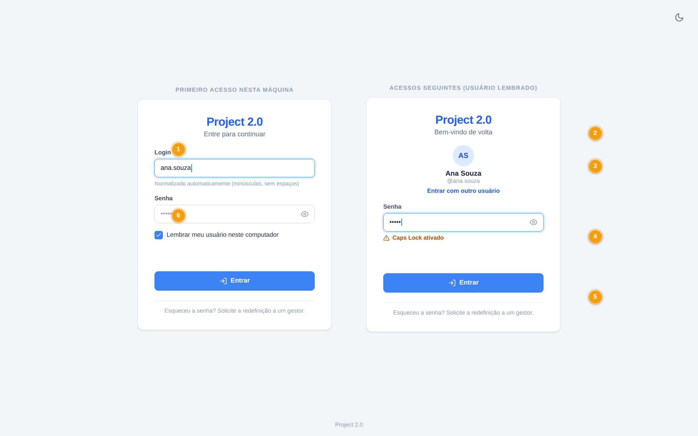

**Callouts:** ① autofocus inteligente (Login vazio → foca Login; usuário lembrado → foca Senha; Enter sempre funciona) · ② estado "Bem-vindo de volta" lembra **apenas o login** — a senha nunca vai ao localStorage · ③ "Entrar com outro usuário" no lugar de "Esquecer identificação" (lixeira) · ④ aviso de Caps Lock + área de mensagem com altura reservada (o botão nunca pula) · ⑤ pós-login → `returnUrl` ou `/ponto` · ⑥ validação alinhada ao backend + normalização do login.

**Ganhos:** login recorrente = senha + Enter (0 cliques); deep link aterrissa no destino; risco de segurança eliminado.

### 3.2 Topbar / Layout global (todas as telas)

**Hoje:** logo aponta para `/atividade` (≠ rota padrão); execução ativa invisível; tema a 2 cliques dentro do popover; identidade do usuário só via hover; "Sair" exposto colado ao perfil (logout acidental); toast bottom-center cobre footers de dialogs; nenhum atalho de teclado; nav estoura em janelas menores.

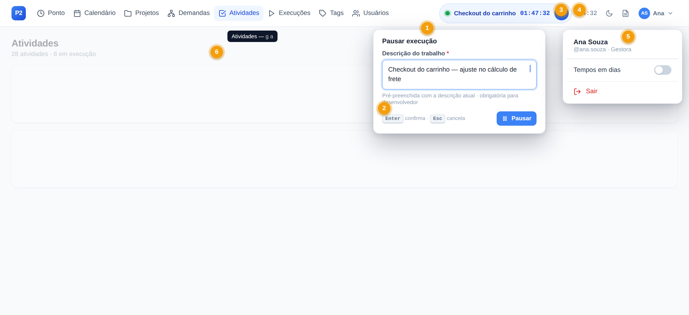

**Callouts:** ① **chip de execução ativa** — descrição truncada + cronômetro ao vivo + pausar; clique no corpo → `/execucao`; atualiza em `visibilitychange` (o backend auto-encerra às 23:59) · ② popover de pausa com descrição **pré-preenchida** (obrigatória p/ dev, opcional p/ gestor — regra real do DTO) e Enter confirma · ③ tema claro/escuro em 1 clique · ④ anotações só-ícone (consistência + espaço p/ o chip) · ⑤ avatar com iniciais + menu com identidade, switch "Tempos em dias" e **Sair dentro do menu** · ⑥ atalhos de teclado nos tooltips (`g a`, `n`…).

**Ganhos:** conferir/pausar timer de qualquer tela: 4+ cliques → 1–2; tema: 2 → 1 clique; logout acidental eliminado.

### 3.3 Ponto — visão mensal (`/ponto`, rota padrão)

**Hoje:** dev não consegue imprimir o próprio espelho (botão é gestor-only por engano de condição); justificar exige ir ao header e re-selecionar o dia no datepicker (~9 passos); spinner apaga a tela a cada troca de mês e ao voltar à aba; horários com data repetida; saldo sem contexto de meta.

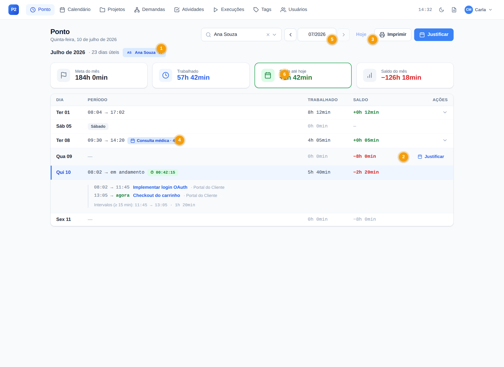

**Callouts:** ① chip do usuário removível (gestor volta à equipe em 1 clique) · ② **"Justificar" inline na linha do dia** com dia e déficit pré-preenchidos · ③ **"Imprimir" também para o desenvolvedor** (backend já permite; corrigir assinatura do gestor) · ④ badge de justificativa clicável (gestor) abre o dialog naquele dia · ⑤ navegação de mês com "Hoje" + atalhos ←/→/T · ⑥ card **"Saldo até hoje"** (só no mês corrente) + horários `HH:mm` + intervalos ≥ 15 min (valor real da config).

### 3.4 Ponto — visão equipe (gestor)

**Hoje:** grid de cards sem triagem: nenhuma contagem, ordenação ou filtro de ativos; nome do usuário não é clicável (abrir o mensal = 3 cliques num select sem busca); contador de pausas sem explicação.

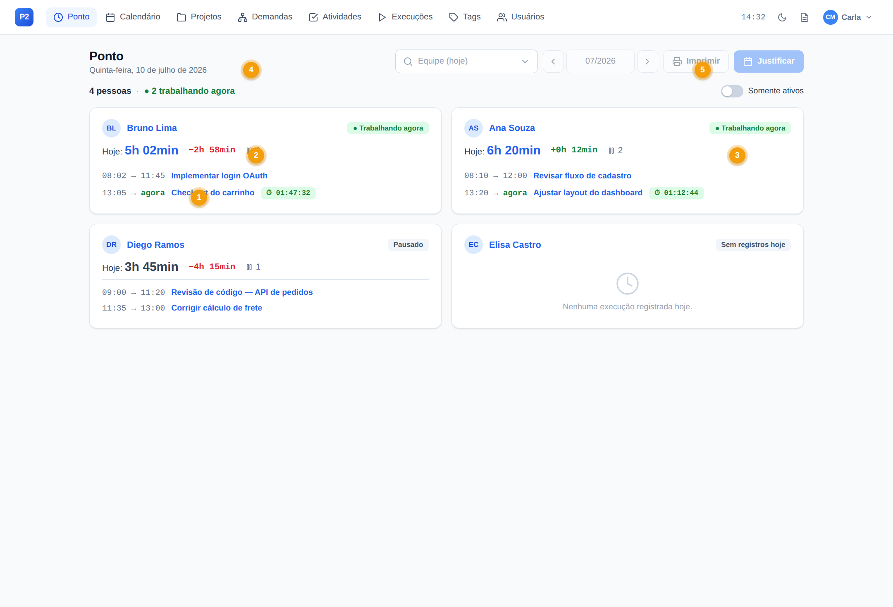

**Callouts:** ① **nome/avatar clicável** abre o mensal daquele usuário (1 clique) · ② barra de triagem "4 pessoas · 2 trabalhando agora" · ③ toggle "Somente ativos" (filtro client-side) + ativos ordenados primeiro · ④ select de usuário **com busca** · ⑤ header com posições fixas (controles desabilitam em vez de sumir — sem layout shift).

### 3.5 Ponto — dialog "Justificar" (gestor)

**Hoje:** abre vazio (dia e horas nunca pré-preenchidos), sem autofocus, Enter não salva, botão "Salvar" no corpo e "Fechar" no footer, remoção com confirm modal central longe do cursor.

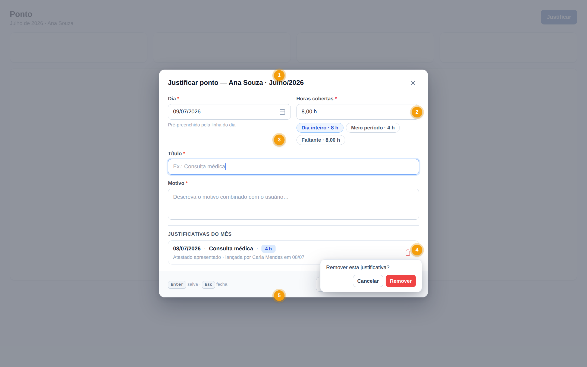

**Callouts:** ① dia pré-preenchido pela linha que abriu · ② **chips de horas** (Dia inteiro · Meio período · Faltante, em decimal como o campo) · ③ autofocus no Título · ④ remoção com confirm-popup ancorado na lixeira · ⑤ Enter salva; ações agrupadas no footer.

### 3.6 Atividades — listagem (`/atividade`)

**Hoje:** a tela mais usada. Registrar execução manual parte de 2 datetimes vazios (~12 cliques); nada indica que você tem execução ativa (o erro só vem do backend); filtros somem ao navegar; 5 icon-buttons por linha; toda ação recarrega a lista inteira (perde scroll); 3 ícones de documento por linha geram ruído; exclusão com confirm.

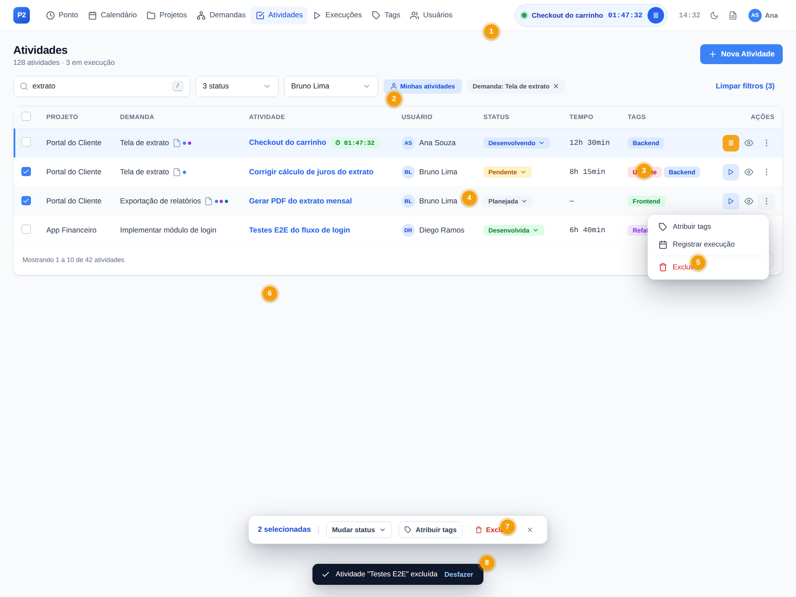

**Callouts:** ① chip de execução na topbar substitui o "caçar a linha do pause" · ② filtros persistentes na URL + chip-toggle **"Minhas atividades"** + chip de contexto `Demanda: X ✕` + "Limpar filtros (3)" só quando há filtros · ③ ações enxutas: **Play/Pause grande** (disabled com tooltip que ensina a regra de status) + Visualizar + kebab ⋮ · ④ status inline otimista (sem reload) · ⑤ kebab com Tags / Registrar execução / Excluir · ⑥ **indicador único de documentos** da demanda (pontinhos coloridos → popover) no lugar de 3 ícones por linha · ⑦ seleção múltipla com barra de ações em massa (gestor) · ⑧ excluir sem confirm, toast com Desfazer.

### 3.7 Atividades — dialog "Iniciar execução"

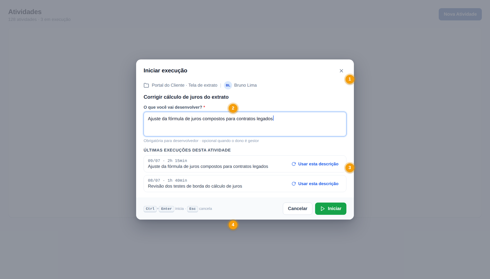

**Callouts:** ① contexto (projeto · demanda · dono) no topo · ② autofocus na descrição · ③ **"Usar esta descrição"** nas últimas execuções — retomar o trabalho sem digitar nada · ④ Ctrl+Enter inicia.

### 3.8 Atividades — dialog "Registrar execução" (gestor)

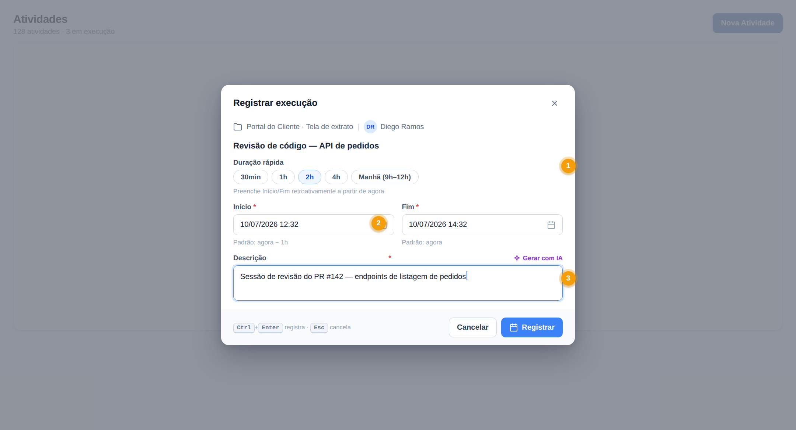

**Callouts:** ① **chips de duração rápida** (30min · 1h · 2h · 4h · Manhã) preenchem Início/Fim retroativamente · ② defaults: Início = agora−1h, Fim = agora · ③ autofocus na descrição + assistente IA. **Ganho: ~12 cliques → 3.**

### 3.9 Atividades — dialog "Visualizar"

**Hoje:** beco sem saída — não mostra projeto/demanda/tempo total e não permite nenhuma ação além de editar nome/descrição; o Quill abre sempre em modo edição, mesmo para leitura.

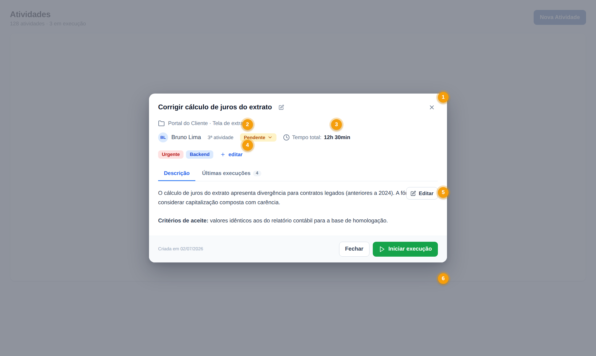

**Callouts:** ① linha de contexto Projeto · Demanda · ② status inline (mesmo popover da tabela) · ③ tempo total executado · ④ tags editáveis ali mesmo · ⑤ descrição em **modo leitura** com botão "Editar" (Quill só carrega ao editar) · ⑥ **Play/Pause no footer** — agir sem fechar o dialog.

### 3.10 Nova Atividade — página (`/atividade/nova`)

**Hoje:** rota órfã e duplicada (o dialog da listagem tem mais recursos e defaults diferentes); sem seletor de demanda (sem `?demandaId` é beco sem saída com toast tardio); não expõe responsável nem tags (o backend aceita `usuarioId` e `tagIds`); status default divergente.

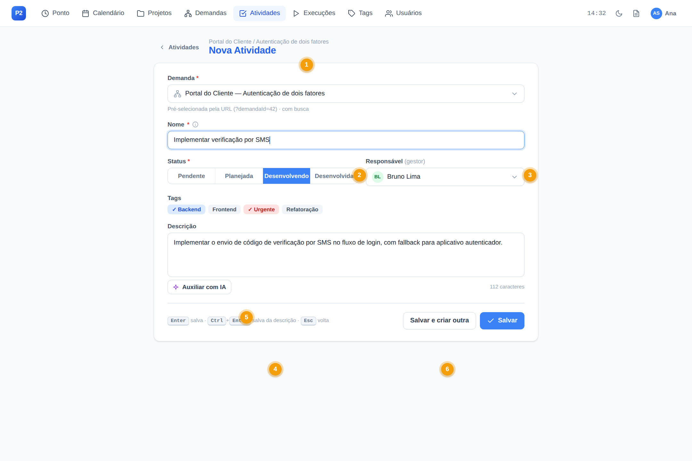

**Callouts:** ① breadcrumb de contexto + **demanda como seletor com busca** pré-preenchida pela URL · ② status em botões segmentados, default **Desenvolvendo** (alinhado ao dialog) · ③ **Responsável (gestor) + Tags direto na criação** · ④ teclado de ponta a ponta (Enter salva, Ctrl+Enter da descrição, Esc volta) · ⑤ IA com gate correto (≥10 caracteres, tooltip explica) · ⑥ **"Salvar e criar outra"** mantém demanda/status/responsável/tags. *Recomendação estrutural: unificar num único componente com o dialog da listagem.*

### 3.11 Assistente de descrição (IA)

**Hoje:** botão habilita com 1 caractere mas o backend exige 10 (erro 400 silencioso); resultado em 2 painéis que empurram o formulário; texto não é editável antes de aceitar; sem regenerar; substituição destrutiva.

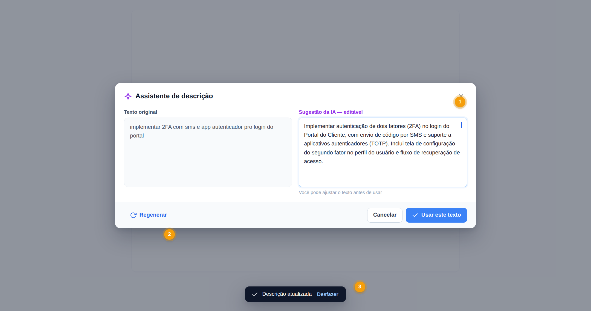

**Callouts:** ① sugestão em **textarea editável** antes de usar · ② "Regenerar" · ③ toast com **"Desfazer"** após aceitar.

### 3.12 Atividade — detalhe (`/atividade/:id`)

**Hoje:** sem timer (o componente pronto não é usado); pausar é impossível nesta tela; iniciar **redireciona para /execucao** (expulsa do contexto); botão Iniciar ignora todas as regras (posse, status, execução dupla) e o erro só vem do backend; descrição/tags via dialogs; execuções recentes sem executor e com duração em "135 min".

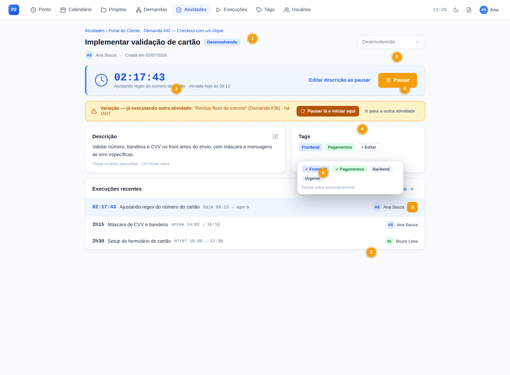

**Callouts:** ① breadcrumb correto (Atividades › Projeto · Demanda) · ② registrar tempo (gestor) sem voltar à listagem · ③ **faixa hero com timer ao vivo** — iniciar permanece na página (otimista) · ④ **pausar em 1 clique** e, se já há execução em outra atividade, aviso com **"Pausar lá e iniciar aqui"** (1 clique encadeia encerrar+iniciar) · ⑤ regras visíveis: status bloqueado durante execução (tooltip), play desabilitado com explicação · ⑥ descrição click-to-edit e tags em popover (sem dialogs).

### 3.13 Demandas — modo Lista (`/demanda`)

**Hoje:** toda visita começa selecionando projeto (nada é lembrado); **não há busca nem filtro** (o `filtroStatus` existe no código do grafo mas nunca ganhou UI); todas as ações só no botão-direito; clique na linha expande em vez de abrir (inconsistente com o grafo); qualquer alteração colapsa a árvore inteira; trocar status na Lista custa 5 cliques (no Planejamento custa 2).

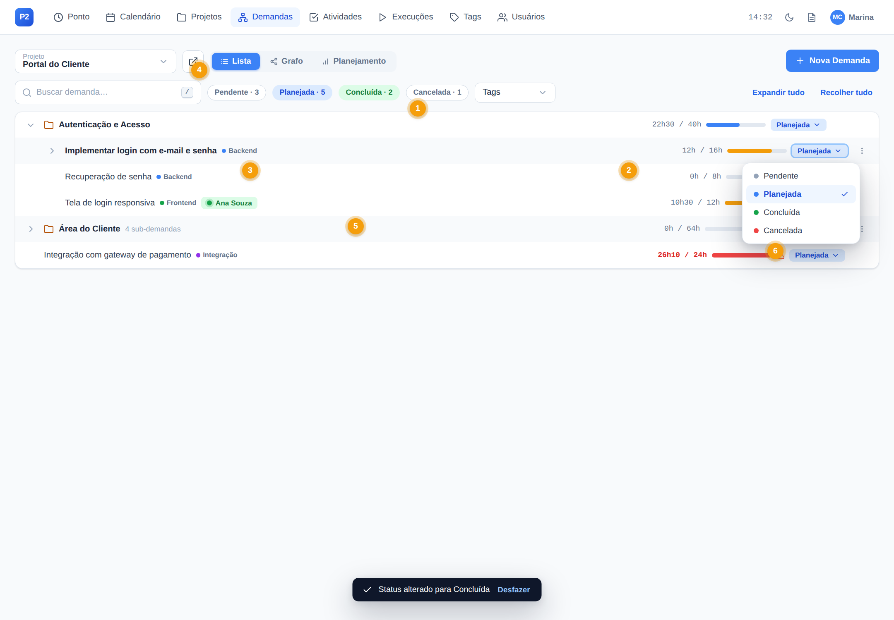

**Callouts:** ① toolbar com busca instantânea + **chips de status com contadores** + tags + expandir/recolher · ② **chip de status clicável em toda linha** (popover, otimista, com Desfazer) · ③ clique na linha abre o detalhe; chevron expande; ações `+` e `⋮` visíveis no hover · ④ projeto lembrado + modo persistido na URL · ⑤ **"executando agora"** e mini-barra de progresso na própria lista · ⑥ "+" de sub-demanda no hover das estruturais.

### 3.14 Demandas — modo Grafo

**Hoje:** cores dark hardcoded quebram o tema claro; dados do nó só em tooltip nativo `<title>` (delay, sem formatação); legenda em painel fixo de 240px meramente informativo; impossível filtrar.

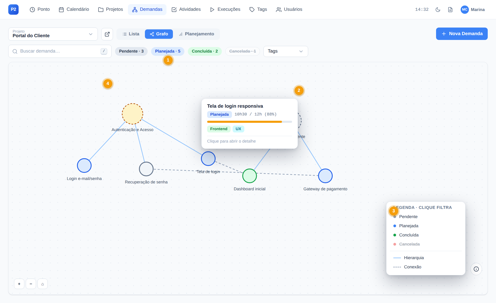

**Callouts:** ① os mesmos chips de status/tags/busca **filtram o grafo** · ② hover-card rico (nome, status, progresso, tags; clique abre o detalhe) · ③ legenda vira **popover-filtro** (cada status é clicável) e libera 240px de canvas · ④ tokens do tema (grafo respeita claro/escuro).

### 3.15 Demandas — dialog "Detalhe"

**Hoje:** 100% somente leitura (mudar status = 5 cliques via dialog aninhado com GET+spinner); tags e membros enterrados em abas E com dialog extra redundante; conexão nova via select de 200 itens **sem busca**; navegação interna refaz ~8 requests sem "voltar"; "excluir" ameaça "não pode ser desfeita" (falso — é soft delete).

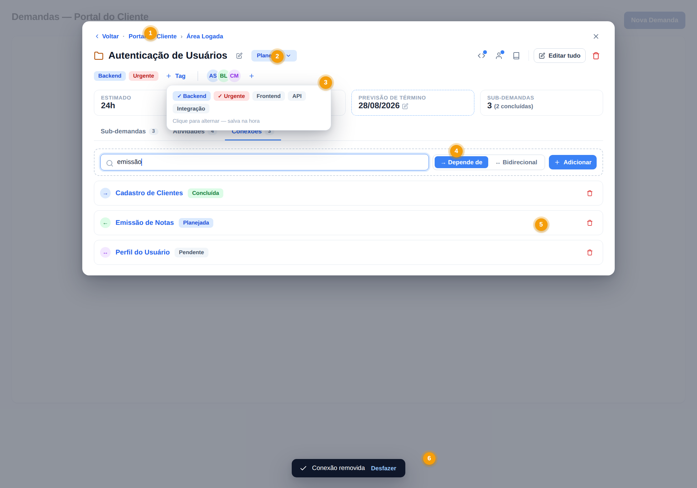

**Callouts:** ① breadcrumb com **"← Voltar" instantâneo** (cache da navegação interna) · ② status-dropdown no tag + título com lápis + métricas click-to-edit (previsão com atalhos +1 sem/+2 sem/fim do mês) · ③ **tags e membros promovidos ao cabeçalho** — popover-toggle salva na hora (eliminam 2 abas e 2 dialogs) · ④ previsão de término click-to-edit · ⑤ **conexão inline com autocomplete + direção** (fim do select de 200 itens sem filtro; erro de ciclo aparece inline) · ⑥ remoções com Desfazer.

### 3.16 Demandas — dialog "Nova Demanda"

**Hoje:** sem autofocus; Enter não cria; **o dialog não fecha após criar** (reseta silenciosamente — parece bug); formulário mostra tudo de uma vez; criar estrutural continua exigindo horas/previsão.

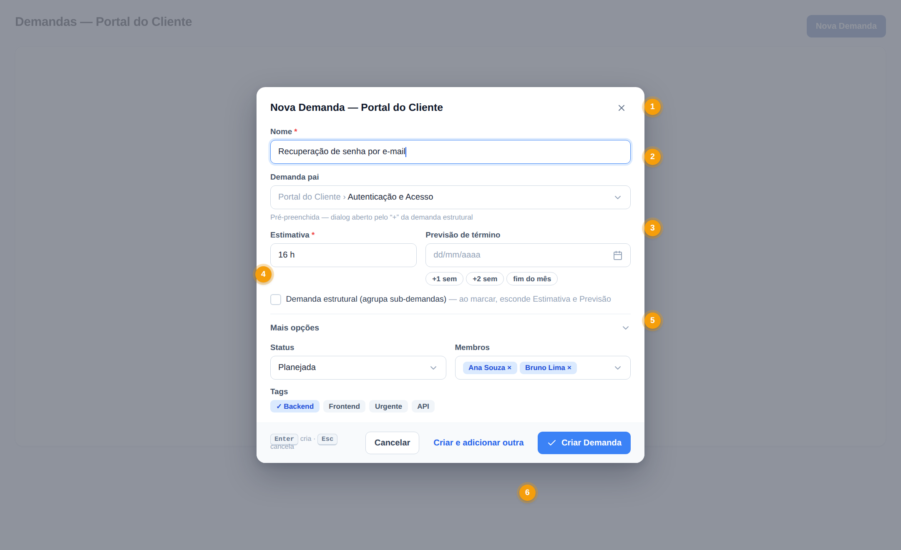

**Callouts:** ① autofocus no Nome · ② pai pré-preenchido pelo contexto · ③ atalhos de data · ④ marcar "estrutural" esconde Estimativa/Previsão · ⑤ "Mais opções" colapsado (status/membros/tags) · ⑥ footer com **"Criar Demanda" (fecha)** + **"Criar e adicionar outra"** (explícito) + Enter cria.

### 3.17 Execuções (`/execucao`)

**Hoje:** relatório só acessível via Projetos → detalhe → botão (2 telas de distância); colunas repetem a data em toda linha; execução em andamento sem destaque nem duração ao vivo; select de usuário sem busca; edição só pelo lápis minúsculo; empty state morto.

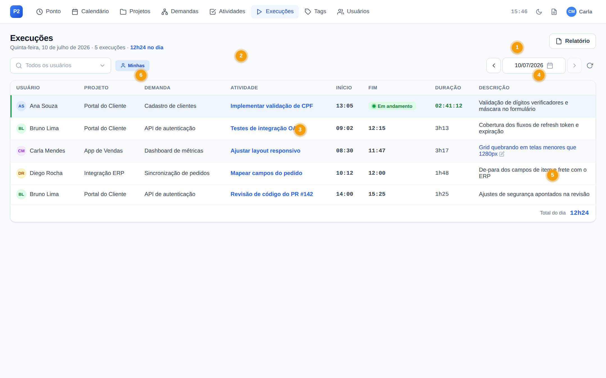

**Callouts:** ① **botão "Relatório" no header** (com select de projeto no dialog) · ② subtítulo com contexto e total do dia sem scroll · ③ linha ativa fixada no topo com tag pulsante e **cronômetro ao vivo**; colunas só com `HH:mm` · ④ navegação de dia por teclado (←/→/Home) e estado na URL · ⑤ célula de descrição clicável (alvo ~20× maior) com validação inline no dialog de edição · ⑥ select com busca + chip "Minhas".

### 3.18 Dialog "Relatório de Execuções" (+ revisão por IA)

**Hoje:** abre vazio mesmo com defaults válidos (preview é clique obrigatório); resultado antigo fica na tela sem marca de obsoleto ao trocar filtros (risco de baixar CSV do período errado); **"Revisar com IA" permanentemente desabilitado** ("Em breve") apesar de endpoint e DTOs prontos no backend.

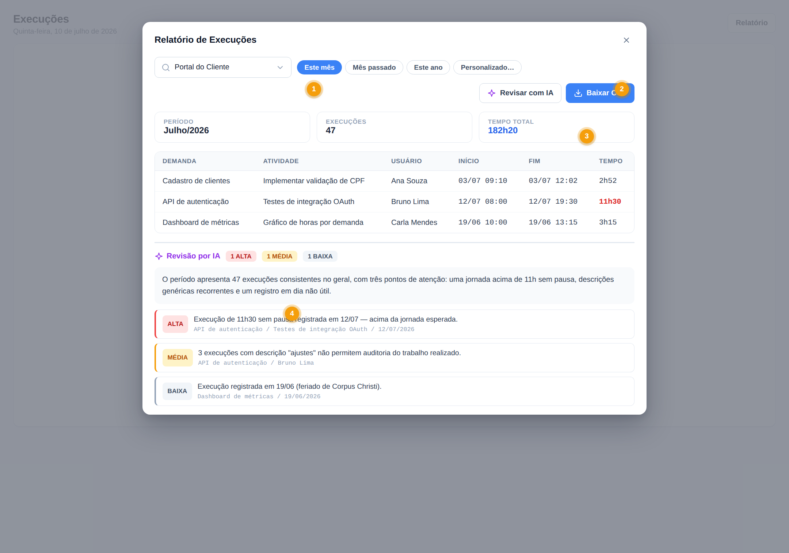

**Callouts:** ① **chips de período** (Este mês · Mês passado · Este ano · Personalizado) · ② **preview automático** ao abrir e a cada filtro (debounce; resultado esmaece durante refetch); "Baixar CSV" promovido a ação primária · ③ totais como stat-tiles · ④ **"Revisar com IA" habilitado**, com contadores por severidade e achados ordenados ALTA→BAIXA.

### 3.19 Projetos — listagem (`/projeto`, gestor)

**Hoje:** sem busca/filtro; trocar status exige entrar no detalhe e abrir o dialog de edição (~6 cliques); lixeira permanente no card com confirm; edição só pelo detalhe.

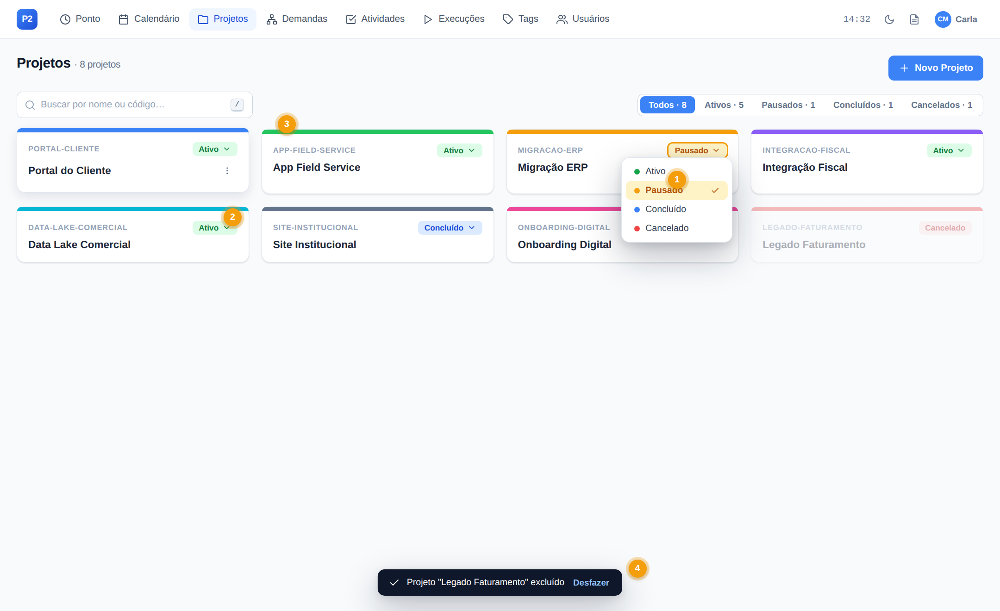

**Callouts:** ① **tag de status clicável no card** (menu, otimista) — 6 cliques → 2 · ② kebab ⋮ com "Editar" na própria listagem · ③ busca instantânea + filtro segmentado com contadores, persistidos na URL · ④ exclusão com Desfazer no toast.

### 3.20 Projeto — detalhe (`/projeto/:id`)

**Hoje:** sem resumo do projeto (progresso/contagens); ações da árvore só no botão-direito; sem busca; sem atalho para Grafo/Planejamento; datas invisíveis quando nulas.

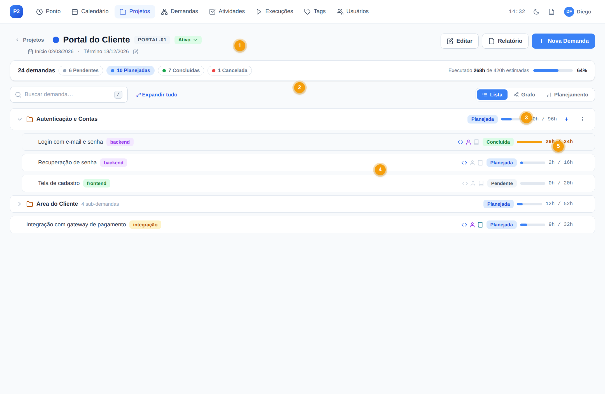

**Callouts:** ① tag de status interativa no cabeçalho · ② **faixa de resumo** (contadores por status clicáveis + progresso executado/estimado — tudo client-side dos dados já carregados) · ③ toggle Lista | Grafo | Planejamento navega para `/demanda` com o projeto selecionado · ④ **indicadores T·C·D** (técnica/cliente/doc) coloridos quando preenchidos, clique abre direto · ⑤ ações `+` e `⋮` no hover da linha.

### 3.21 Usuários — listagem (`/usuario`, gestor)

**Hoje:** ativar/inativar exige perfil → editar → select → salvar (~5 cliques); toda edição passa pelo pedágio do dialog de perfil; filtros dropdown; exclusão com confirm.

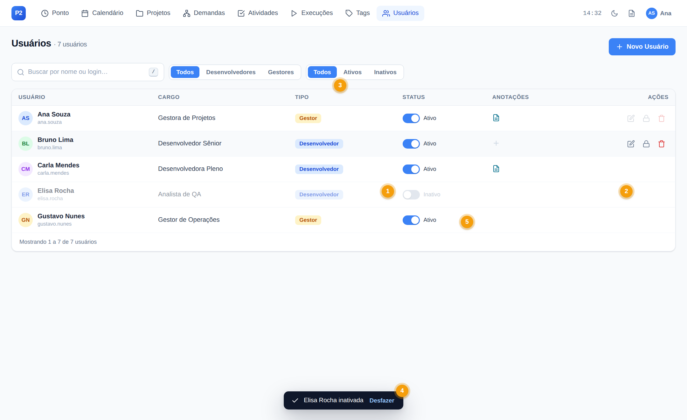

**Callouts:** ① **status como switch inline** na linha (1 clique, otimista, Desfazer) · ② ações diretas no hover (editar / senha / excluir) sem passar pelo perfil · ③ filtros segmentados de 1 clique (Tipo e Status) · ④ undo no toast · ⑤ anotações do usuário a 1 clique (ícone destacado quando existem).

### 3.22 Usuários — dialog "Novo Usuário"

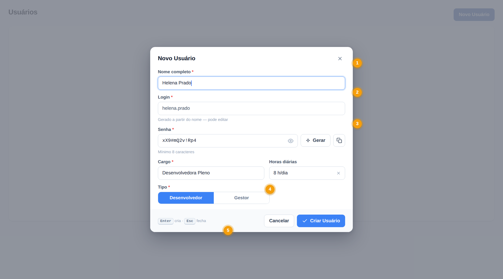

**Callouts:** ① autofocus no Nome · ② **login auto-gerado** a partir do nome (editável) · ③ **"Gerar senha"** forte + copiar · ④ tipo default "Desenvolvedor" em botões segmentados · ⑤ Enter cria. *(Editar reutiliza o mesmo dialog, sem o campo senha, que tem dialog próprio.)*

### 3.23 Anotações (topbar + por usuário)

**Hoje:** modal de **95vw×95vh** que cobre o app inteiro para uma nota pessoal; Esc e clique-fora desabilitados; fechar com pendências abre confirm "Salvar/Descartar" (um misclick perde texto); auto-save cego a cada 30s **mesmo sem alterações** (PUTs inúteis que ainda forçam reload da listagem ao fechar).

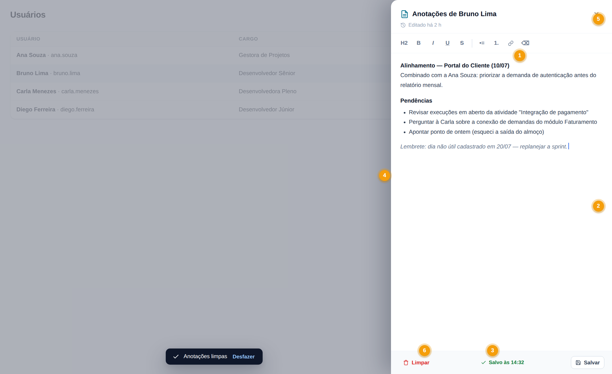

**Callouts:** ① toolbar enxuta (9 controles) · ② autofoco no editor — o empty state é o próprio campo · ③ **indicador vivo "Editando… → Salvando… → ✓ Salvo às 14:32"** com auto-save por mudança (debounce 2s), não por relógio · ④ **drawer lateral (~520px)** — anotar olhando os dados da tela · ⑤ Esc/clique-fora fecham **salvando** (flush no fechamento; sem confirm) · ⑥ "Limpar" com Desfazer (7s) em vez de confirm "irreversível".

### 3.24 Calendário — dias não úteis (`/calendario`, gestor)

**Hoje:** o calendário é só visualização (criar exige o botão do header + selecionar a data de novo no dialog); dia marcado não é clicável; navegação para outro ano = até 17 cliques nos chevrons; tabela com colunas "Duração"/"Recorrente" esparsas; sem legenda.

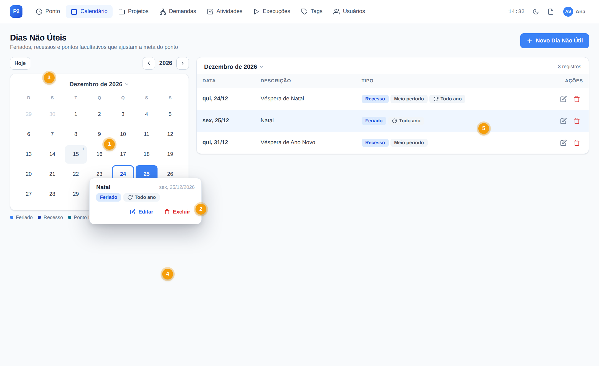

**Callouts:** ① **clique num dia vazio cria** (dialog abre com a data preenchida e foco na descrição) · ② **clique num dia marcado abre popover** com editar/excluir e destaca a linha na tabela · ③ botão "Hoje" + stepper de ano · ④ legenda fixa (cores + anel = meio período) · ⑤ badges compactos na linha (tipo + meio período + "todo ano"). *(Dica extra: no editar, link "Excluir e recriar" contorna a data imutável do DTO.)*

### 3.25 Tags (`/tag`, gestor)

**Hoje:** criar tag abre dialog completo com colorpicker gigante; excluir com confirm; sem busca; trocar só a cor exige o dialog inteiro.

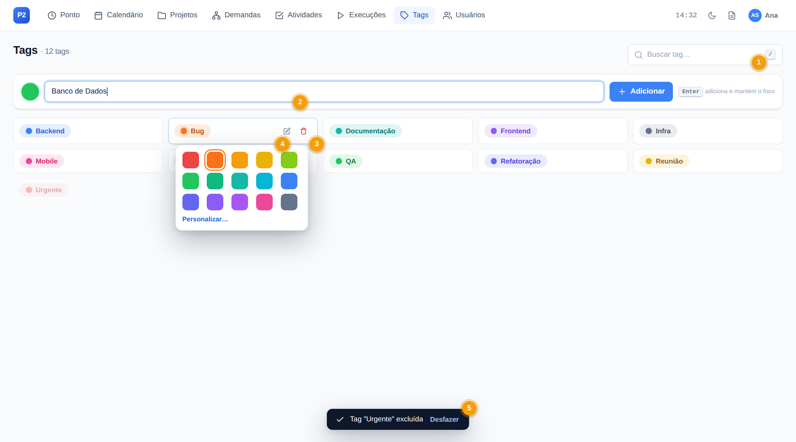

**Callouts:** ① busca com `/` · ② **quick-add sempre visível** — nome + Enter cria e mantém o foco (5 tags = 5 nomes + 5 Enters, zero dialogs) · ③ **popover de paleta no dot de cor** — troca de cor inline com PUT imediato · ④ ações no hover do card · ⑤ exclusão com Desfazer.

---

## 4. Notas de verificação (correções aplicadas sobre as propostas)

Durante a verificação contra o código e as regras de negócio, os seguintes ajustes foram incorporados às propostas (evitam implementar algo incorreto):

- **Login**: credencial inválida retorna **HTTP 400** (`BusinessException`), nunca 401 (401 = sessão expirada, tratada pelo interceptor global). O erro inline deve usar `erro.error.mensagem` (preserva "Usuário inativo") e **suprimir o toast global duplicado** via `HttpContext`. `returnUrl` precisa de sanitização (`router.parseUrl`, rejeitar URL absoluta) e deve ser gravado também no redirect 401 do interceptor.
- **Chip da topbar**: `ExecucaoAtivaDto` não traz o nome da atividade — exibir a **descrição da execução** (fallback "Execução em andamento"). O popover de pausa deve **pré-preencher a descrição atual** (o PATCH sobrescreve; enviar vazio apagaria). Atualizar o chip em `visibilitychange` (cron do backend auto-encerra às 23:59:59).
- **Ponto**: intervalos são **≥ 15 min** (`intervaloMinimoMinutos`), não 10; não existe "Férias" por usuário (dias não úteis são globais); `metaMinutos` do dia **já vem com justificativa descontada**; badge/ação de justificar são gestor-only (endpoints `@GestorOnly`); condição do Imprimir = modo mensal **ativo** (o signal não é limpo ao voltar à equipe); na impressão pelo dev, não estampar o próprio dev como "Gestor responsável".
- **Undo de exclusão** (atividade/projeto/usuário/tag/calendário): **não existe endpoint de restauração** — requer `PATCH /:id/restaurar` ou DELETE adiado no cliente (enviar ao expirar o toast; "Desfazer" cancela). Undo de remoção de membro/conexão e de troca de status funciona **hoje** (re-POST/PUT).
- **Usuários**: contador "N ativos" exigiria request extra (a listagem só traz `totalItens` do filtro corrente); ordenação de colunas não é suportada pelo DTO atual; usar `p-toggleswitch` (o `InputSwitch` não existe no PrimeNG 21); primeira visita do filtro Status em "Todos".
- **Anotações**: emitir `aoAlterar` apenas quando houve mudança real (hoje um PUT sem mudança força reload da listagem); "vazio efetivo" deve replicar a regra do backend (HTML `
 
` não conta como conteúdo); undo do "Limpar" tem precedência sobre o flush-ao-fechar.
- **Atalhos de teclado**: sempre ignorados com foco em input/textarea/contenteditable (o editor Quill é contenteditable) e com dialog aberto; atalhos de rotas gestor-only só para gestor.
- **Relatório**: manter contratos existentes — listagem por dia único, relatório por projeto (`projetoId` obrigatório), revisão IA usa `RelatorioRevisaoDto` como está.

## 5. Arquivos desta revisão

| Pasta | Conteúdo |
|---|---|
| [`prints/`](./prints) | 25 prints dos mockups otimizados (callouts âmbar numerados) |
| [`mockups/`](./mockups) | Fonte HTML dos mockups (abra no navegador; `base.css` compartilhado) |
| [`analise-detalhada/`](./analise-detalhada) | Análise completa por tela: fluxos com contagem de cliques, todos os problemas, sugestões com impacto e specs de redesign |

> **Metodologia:** 15 agentes de análise leram o código real de cada tela (HTML/TS/SCSS + services/DTOs) e produziram problemas/sugestões/spec; 5 telas passaram por verificação adversarial completa contra o backend e as regras de negócio (as demais foram verificadas por amostragem — itens críticos conferidos manualmente no código, ex.: inexistência de endpoint de restauração). Os mockups seguem o tema atual (PrimeNG Aura, primário azul, claro/escuro) e **não inventam dados que o backend não fornece**.
